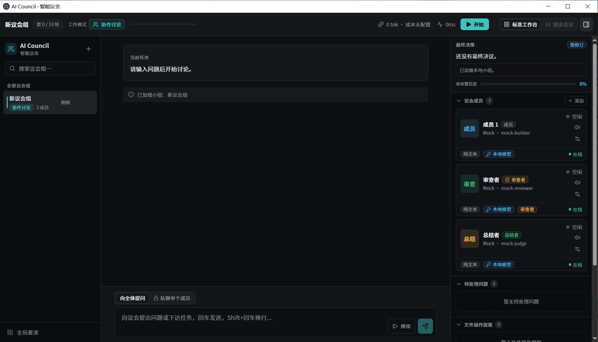

# AI Council

AI Council 是一个本地 AI 议会工具。

你可以建一个小组，把不同模型放进去，让它们围绕同一个问题讨论、互相补充、互相审查。也可以只放一个模型，当普通助手用。

当前版本：`v0.2.0`

## 下载

Windows 用户去右侧 `Releases` 下载：

```text
AI-Council-Setup-0.2.0.exe
```

安装时可以选择软件安装位置，也可以选择数据保存位置。

## 怎么用

1. 新建议会组。
2. 添加成员。
3. 给成员填模型供应商、API 地址、API Key 和模型名。
4. 在底部输入问题，点开始。

API Key 就是模型平台给你的密钥。不要发给别人。

如果你用中转站，供应商选“自定义/中转”，把对方给你的 API 地址填进去。很多地址需要带 `/v1`，这里容易填错。

## 主要功能

- 多个 AI 一起讨论一个问题。
- 每个成员可以单独设置模型、角色和权限。
- 可以设置审查者，让它专门挑问题。
- 支持私聊单个成员。
- 支持模型检测；检测失败时也可以手动填模型名。
- 支持会议决议、待处理问题、文件操作提案。
- 文件写入走本地审批和权限，不会把电脑文件权限直接交给模型。

## 未来计划

- 上下文压缩和长期记忆还比较早期，有待改善。
- 成本统计只在有真实用量或用户配置价格时才可靠。
- 这是早期版本，重要项目请先用测试文件夹试。

## 开发者运行

```bash
cd prototype
npm install
npm run desktop
```

打安装包：

```bash
cd prototype
npm run desktop:installer
```
